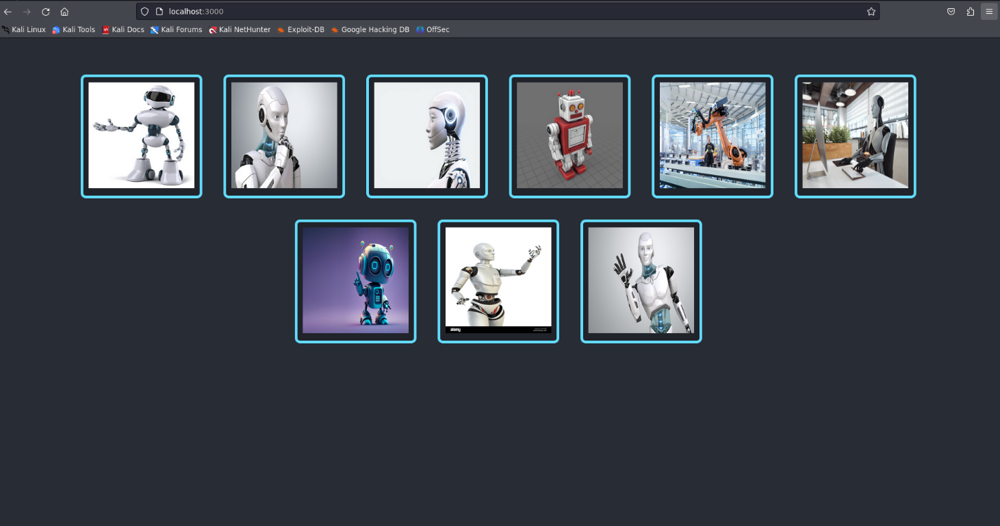
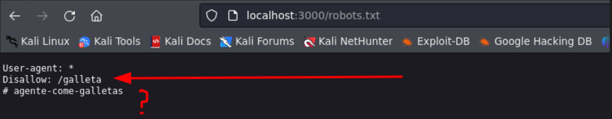
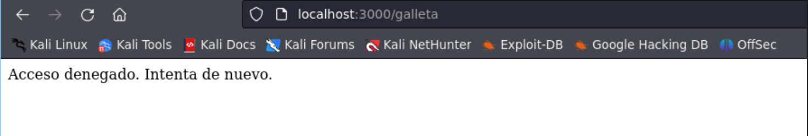
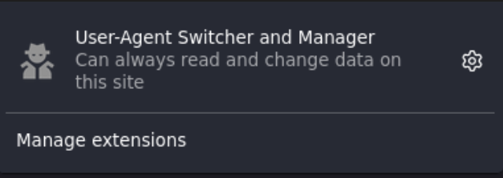
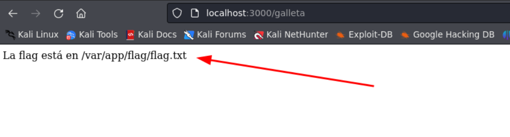
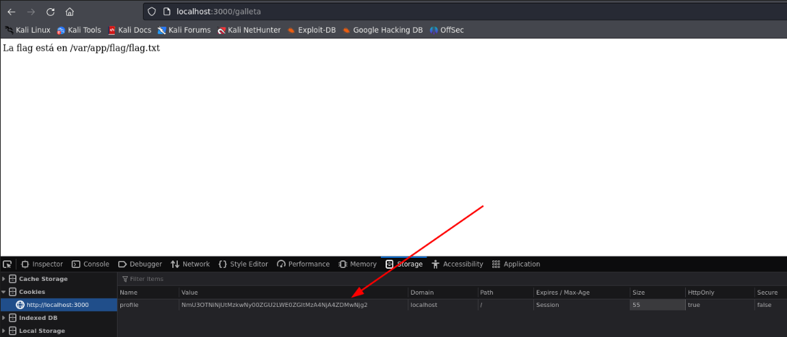
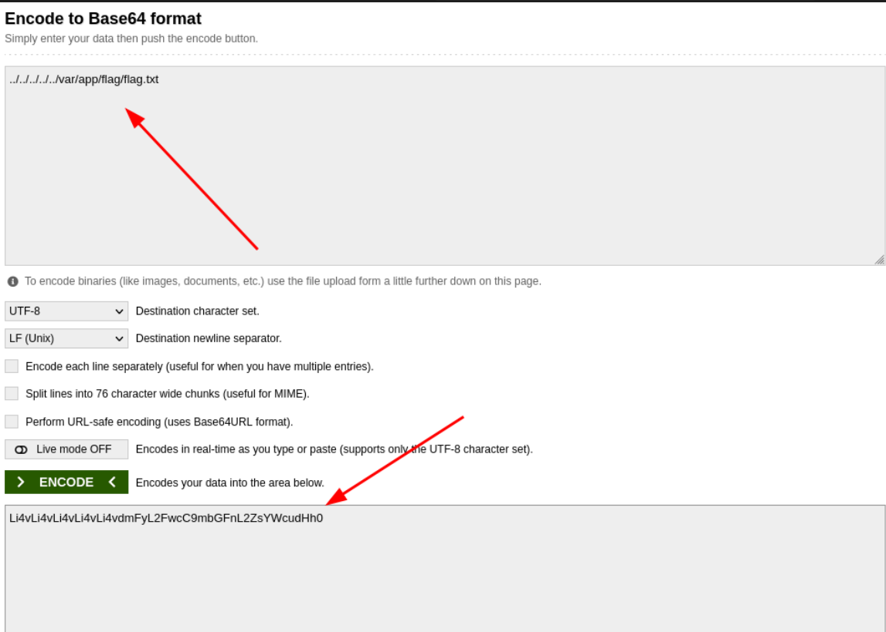
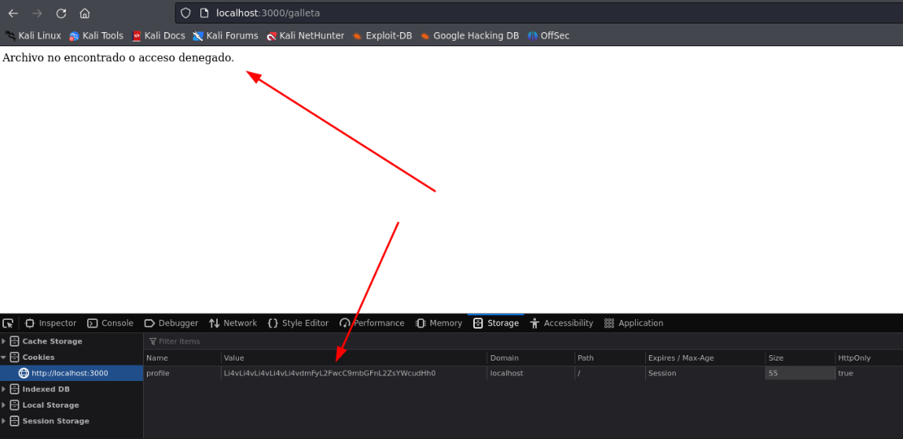
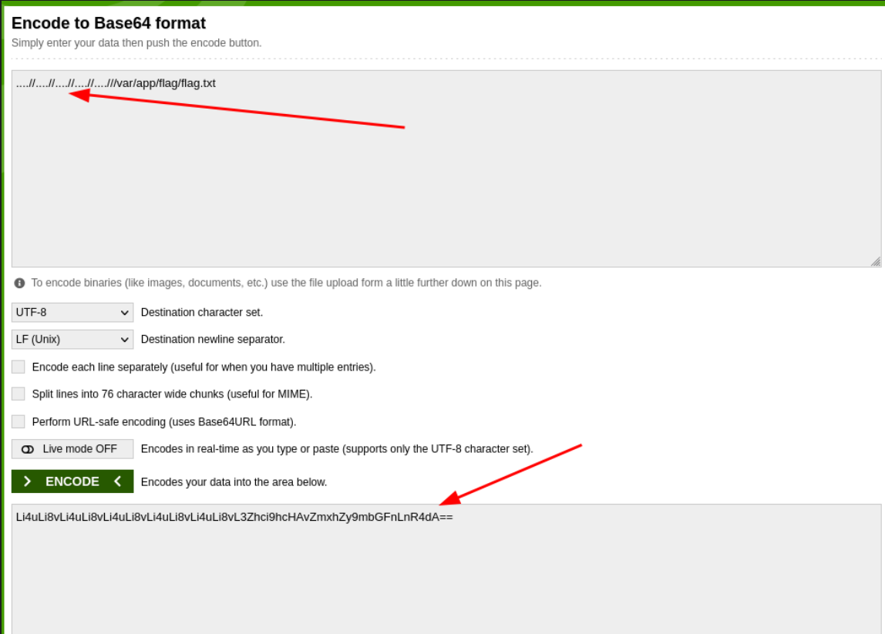
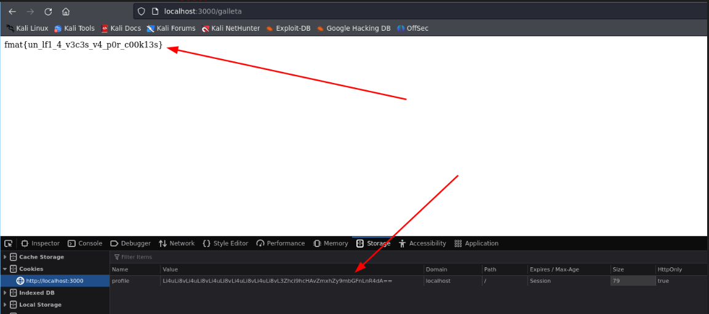

# CookieCrumbs - FMAT CTF

## Descripción
"CookieCrumbs" es un reto de Hacking Web, creado por mí para el CTF realizado en Septiembre del 2024 en la Universidad Autónoma de Yucatán.

## Contexto
En un futuro cercano los robots están dominando al cookie world, y se han propuesto eliminar a cualquiera que se esconda entre las galletas, así que como buen agente secreto, investiga y evita esto a toda costa.

## Solución

Comenzamos con una página web que, a simple vista, solo contiene imágenes de robots. Parece que no hay mucho que ver. 

Al investigar un poco más, sabemos que algunas webs tienen un archivo llamado `robots.txt`. Así que probamos acceder a él, y nos encontramos con algo interesante.

Aquí descubrimos dos cosas: una ruta llamada `/galleta` y una pequeña pista que dice "agente-come-galletas".

Siguiendo la pista, accedemos a la ruta `/galleta`, pero lo primero que nos encontramos es un mensaje de "Acceso denegado. Intenta de nuevo."

La pista "agente-come-galletas" nos sugiere que hagamos algo relacionado con el "user agent" del navegador. Entonces, descargamos una extensión para modificar el user agent.

Después de cambiar el user agent y aplicar los cambios, actualizamos la página con `Ctrl + R` y, ¡sorpresa! Ahora nos muestra un mensaje diferente, dándonos la ruta de la flag, pero nada más.

Al inspeccionar la aplicación un poco más, nos damos cuenta de que la cookie que maneja está codificada en base64.

Así que, con la ruta que nos proporcionó la web, probamos codificarla. Para asegurarnos de que funcione en cualquier ruta, la codificamos como `../../../../../var/app/flag/flag.txt`.

Sin embargo, no obtenemos la flag, solo un nuevo mensaje: "Archivo no encontrado o acceso denegado". Esto nos indica que la aplicación está intentando leer un archivo.

Es probable que esté detectando los `../` y los elimine, así que intentamos con `....//`. Esto debería borrar solo un patrón `../`, permitiéndonos retroceder y leer el archivo.

¡Eureka! ¡Pudimos leer la flag!

Espero que este desafío haya sido divertido para todos los jugadores. Un agradecimiento a Julián y todos los encargados de este CTF por invitarme a desarrollar algo nuevo para mí.

By: Perceval
